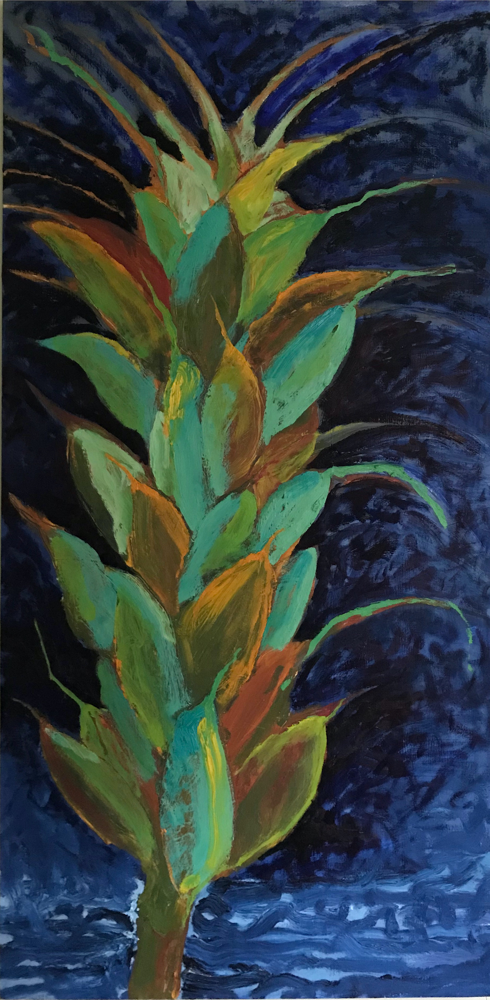
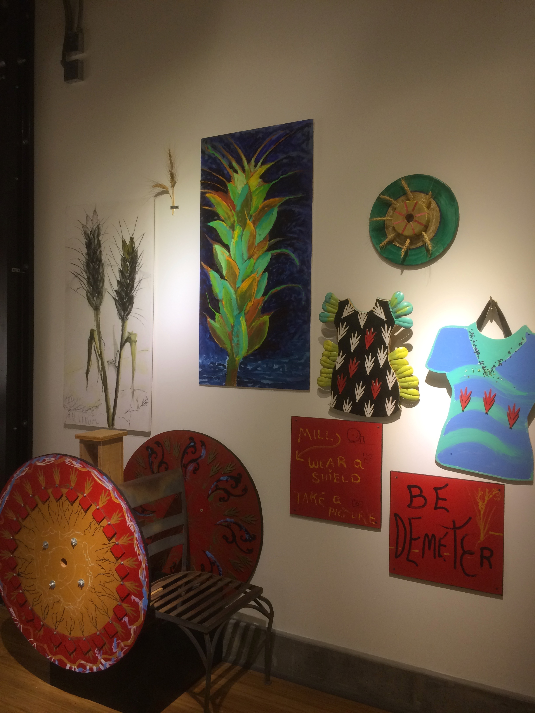
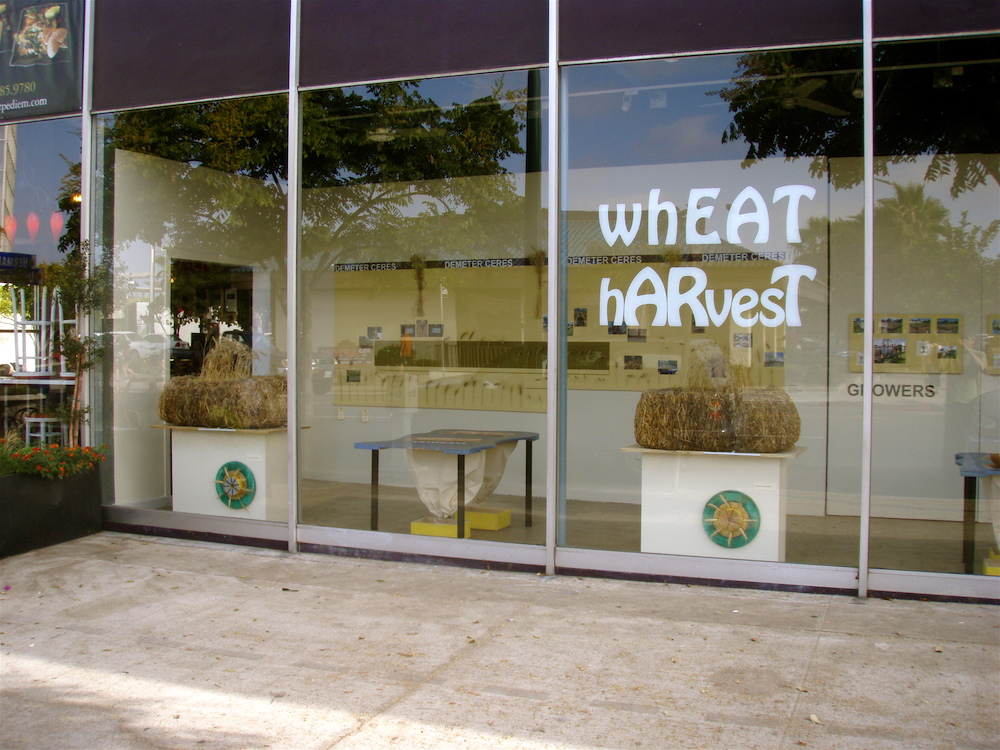

	
  
  
  
  
  
  
  
  
  
  
  
  
  
  
  
  
  

### About

Maybe it’s the fig tree? My yardspace changes every year. One year it was the inspiration for my [wheat harvest project](https://wheatharvest.org/). For some fun click [here](https://www.instructables.com/id/Sunflower-Face/) to see how to make a sunflower face on Instructables.

	<iframe src="https://www.youtube.com/embed/fXa6cDpJF_k" width="640" height="360" frameborder="0" allowfullscreen></iframe>

