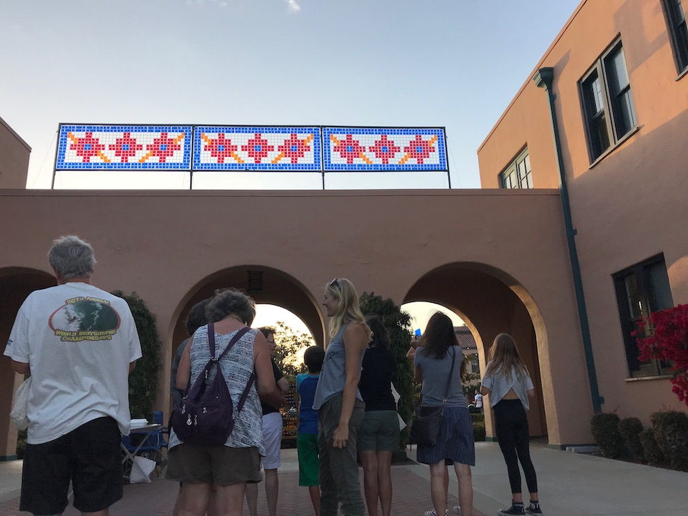
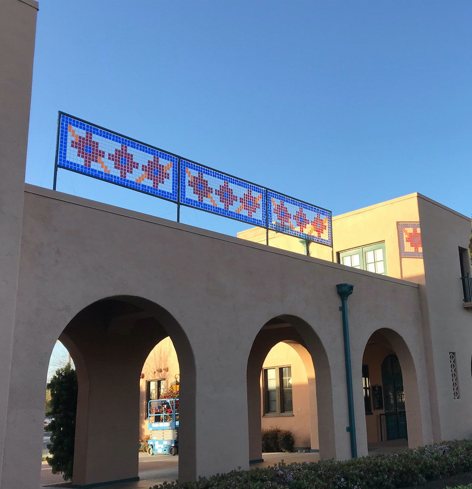
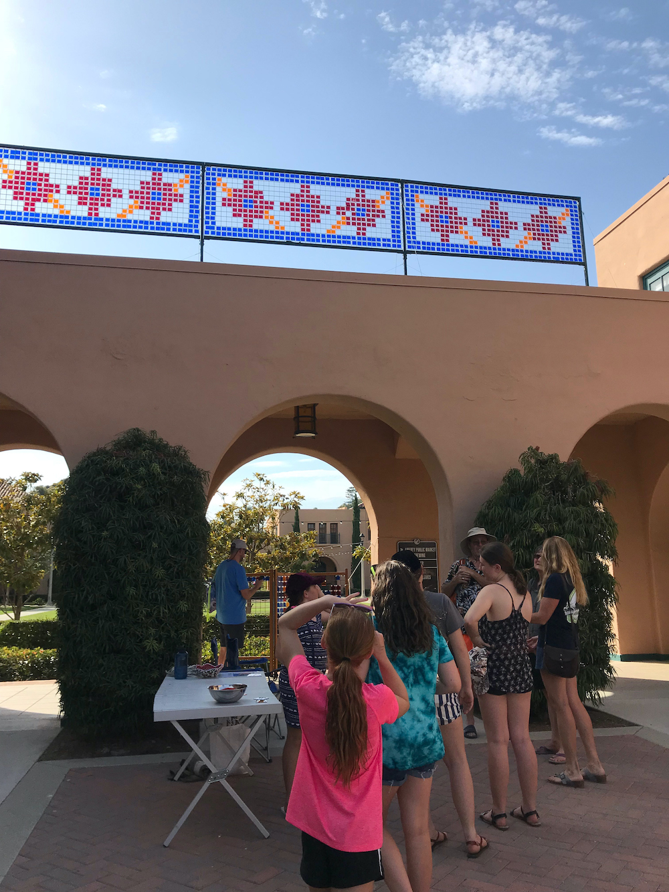
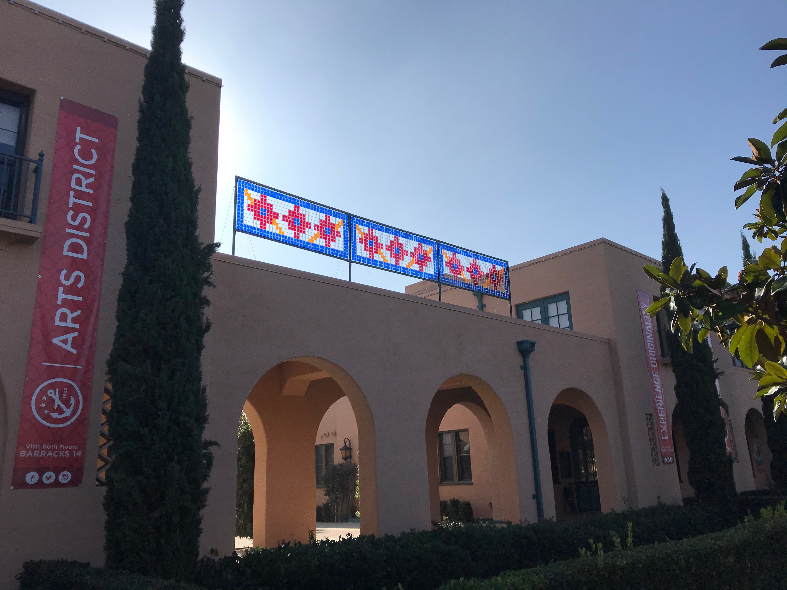
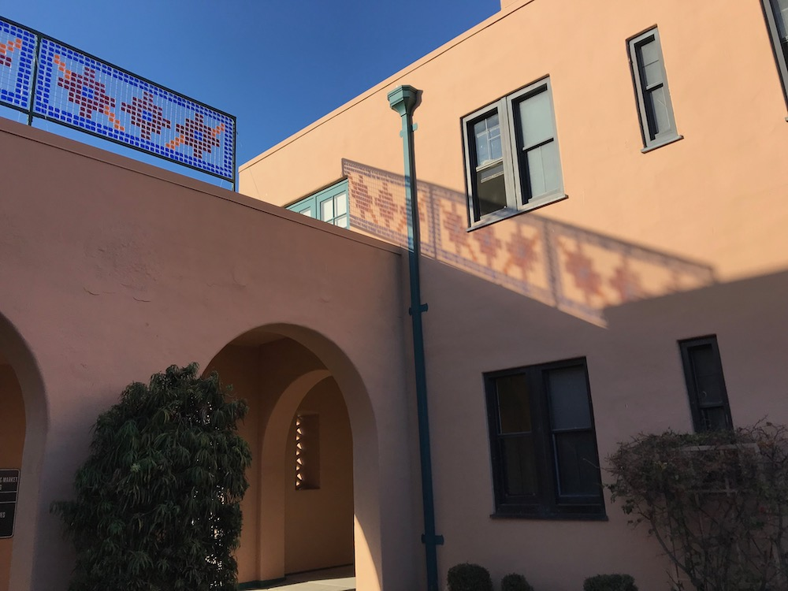

	
  
  
  
  
  
  
  
  
  
  
  
  
  

### About

Not your typical mosaic. These pieces use transparent colored tiles that flutter in the breeze to create colored cast shadows. Whether it’s the [Sky Mosaic](https://www.facebook.com/ArtsDistrictLibertyStation/posts/we-love-how-david-krimmels-sky-mosaic-changes-by-the-minute-with-the-sun-like-an/2054751997886855/) at Liberty Station or a private commission, these art works are creating constant change in color and vibrancy.
